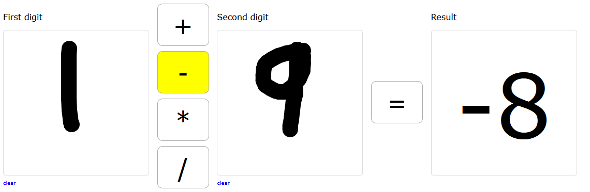
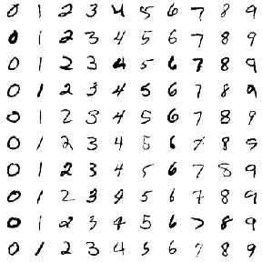
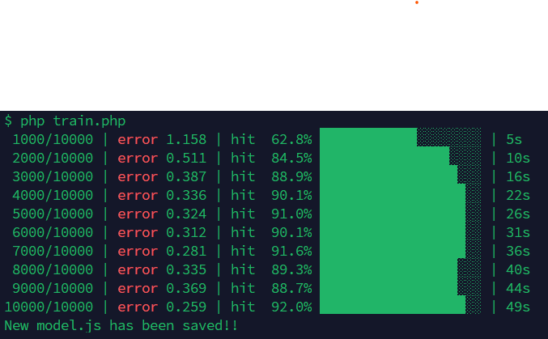
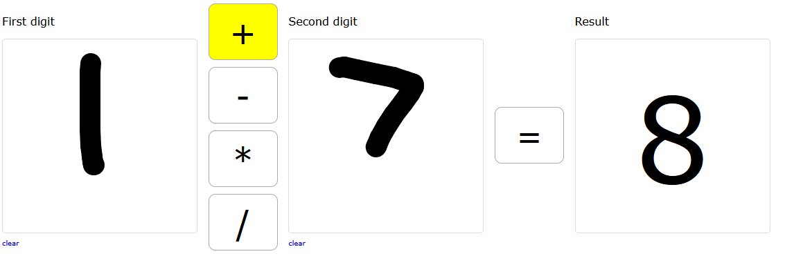
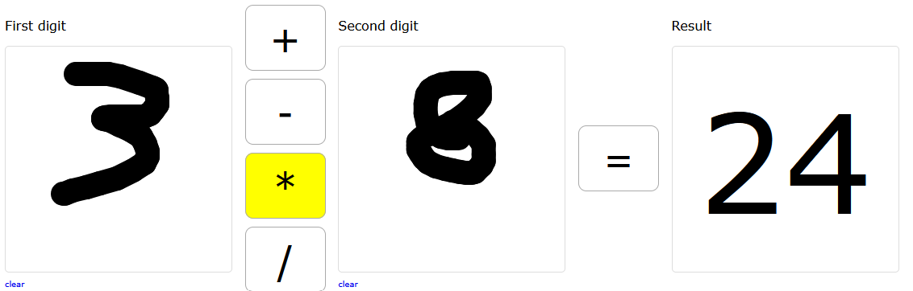

# calc-ai

A calculator where you **draw the numbers by hand**. A neural network written from scratch reads each handwritten digit, and the app runs the operation you pick: `+`, `−`, `×` or `÷`.

The live demo is available in https://luizceniz.lccsistemas.com.br/calc-ai.

There are no machine learning libraries here. Every weight, every forward pass and every backpropagation step is plain PHP and JavaScript, written by hand, so you can follow exactly what the network is doing and why.



---

## Table of contents

- [How it works](#how-it-works)
- [Project structure](#project-structure)
- [Running it](#running-it)
- [Part 1: from a drawing to 784 numbers](#part-1-from-a-drawing-to-784-numbers)
- [Part 2: the neural network](#part-2-the-neural-network)
- [Part 3: training with backpropagation](#part-3-training-with-backpropagation)
- [Part 4: from PHP to the browser](#part-4-from-php-to-the-browser)
- [Results](#results)
- [What I learned](#what-i-learned)
- [The future: real estate](#the-future-real-estate)
- [Limitations and roadmap](#limitations-and-roadmap)

---

## How it works

```
 draw ─► crop ─► shrink to 20×20 ─► place in 28×28 ─► center of mass ─► network ─► "3" (99.8%)
 draw ─► crop ─► shrink to 20×20 ─► place in 28×28 ─► center of mass ─► network ─► "6" (93.1%)
                                                                                     │
                                                          operation (+ − × ÷) ───────┴─► 3 + 6 = 9
```

The project has two independent halves:

| | Where | When | What it does |
|---|---|---|---|
| **Training** | `training/train.php` | Once, offline, in the terminal | Learns from 60,000 handwritten digits and saves the weights to `web/model.js` |
| **Recognition** | `web/front.js` | Every time someone draws | Converts the drawing to the MNIST format and runs it through the trained network |




The browser never trains anything and never calls a server. It only loads the learned weights and does the math.

### Why the arithmetic is not done by the network

The network does one thing: **recognize a digit** (a classification problem, the core of OCR). The arithmetic itself runs as regular code.

Code is exact and works for any number. A network trained to add would give approximate answers (`6.98` instead of `7`) and only inside the range it was trained on. Using a model where it shines, and plain code where it doesn't, is a design decision, not a shortcut.

---

## Project structure

```
calc-ai/
├── training/
│   ├── train.php        reads MNIST, trains the network, writes web/model.js
│   └── train.csv        MNIST training set (not committed, see below)
└── web/
    ├── index.html       two drawing canvases and the operation buttons
    ├── front.css
    ├── front.js         drawing, preprocessing and the forward pass
    ├── model.js         trained weights and biases (generated)
    └── model-bkp.js     previous model, kept as a backup on each training run
```

---

## Running it

**1. Get the data.** Download `mnist_train.csv` from [MNIST in CSV](https://pjreddie.com/projects/mnist-in-csv/) and save it as `training/train.csv`. The file is over 100 MB, which is GitHub's per-file limit, so it is listed in `.gitignore`.

**2. Train.**

```bash
cd training
php train.php
```

**3. Draw.** Open `web/index.html` in the browser. Because the model is loaded as a plain `<script>`, it works straight from the file system, no server required.

---

## Part 1: from a drawing to 784 numbers

The network was trained on MNIST, so it only understands digits that look like MNIST digits: **28×28 pixels, grayscale, the digit fitted into a 20×20 box, centered by its center of mass**. A raw drawing on a 280×280 canvas looks nothing like that. Most of the work on the front end is closing this gap.

### Step 1: find the drawing (bounding box)

`fitRect()` scans every pixel of the canvas and records the smallest and largest `x` and `y` that contain ink. That rectangle is the drawing; everything outside it is discarded.

The canvas stores pixels as one long flat list, four values per pixel (red, green, blue, alpha), so the pixel at row `y`, column `x` starts at:

```
i = (y × width + x) × 4
```

A pixel counts as ink when it is visible (`alpha > 0`) and dark (`red < 128`).

### Step 2: shrink to 20×20, keeping the proportions

The longer side of the rectangle is scaled to 20 pixels and the other side follows the same ratio. A tall, thin "1" becomes roughly 7×20; stretching it to 20×20 would turn it into a blob.

### Step 3: grayscale by averaging (not black and white)

It is tempting to mark each pixel as `1` (painted) or `0` (empty). MNIST doesn't work that way: strokes have soft edges, with values like `0.3` or `0.6` around a solid core. A network trained on soft edges performs worse on hard ones.

When the 280×280 drawing is shrunk, each small pixel covers a block of roughly 12×12 original pixels. Its value is **how much of that block is painted**:

```
fully painted block  → 1.0
a third painted      → 0.33
empty                → 0.0
```

The browser does this averaging for us: `drawImage()` with `imageSmoothingQuality = 'high'` crops, scales and averages in a single call. Each pixel's alpha is then divided by 255 to land in `0..1`.

The stroke width matters here too. At `lineWidth = 30` on a 280 px canvas, the stroke ends up 2 to 3 pixels thick after shrinking, matching MNIST. With a thin pen, the digit almost disappears.

### Step 4: center of mass

Centering the *rectangle* is not enough. MNIST centers each digit by its **center of mass**: the point where the image would balance if every pixel weighed as much as its ink.

This matters for unbalanced digits. A "6" carries most of its ink in the bottom loop, so its center of mass sits below the middle of its rectangle. In MNIST, 6s are therefore drawn slightly higher than a rectangle-centered 6, and that is where the network learned to look for them.

`centerByMass()` computes a weighted average of the pixel positions:

```
cx = Σ (x × pixel) / Σ pixel
cy = Σ (y × pixel) / Σ pixel
```

and shifts every pixel by `(13.5 − cx, 13.5 − cy)`, so that point lands in the middle of the 28×28 grid. Balanced digits like 0 or 3 barely move; a 6 typically moves up by a couple of pixels. This step noticeably improved the recognition of 6 and 7.

### Step 5: flatten

The 28×28 grid is read row by row into a single list of **784 numbers between 0 and 1**. That list is the network's input.

---

## Part 2: the neural network

```
784 inputs  ──►  64 hidden neurons (sigmoid)  ──►  10 outputs (softmax)
 (pixels)                                          (one per digit, 0 to 9)
```

### Weights live on connections, biases live on neurons

Every connection between two neurons has a **weight**: how much the value passing through it matters. Every neuron has a **bias**: a value it always adds, independent of its inputs. Training adjusts both.

```
weights[l][j][i]   connection from neuron i (layer l) to neuron j (layer l+1)
biases[l][j]       bias of neuron j in layer l+1
```

That gives `784 × 64 + 64 × 10 = 50,816` weights and `64 + 10 = 74` biases.

### What a single neuron does

Every neuron, in every layer, does the same three things:

```
1. multiply each incoming value by the weight of its connection
2. add everything up, plus the bias:          z = b + Σ (w × a)
3. pass the sum through an activation:        a = f(z)
```

The output of one layer becomes the input of the next. That's the whole forward pass.

### Sigmoid in the hidden layer

```
sigmoid(z) = 1 / (1 + e^(−z))
```

It squashes any sum into the range `0..1`. Its curve is what lets the network learn non-linear shapes: without an activation, any number of layers would collapse into a single linear one.

### Softmax in the output layer

The 10 outputs must be read as chances. Softmax turns 10 arbitrary numbers into 10 positive numbers that add up to 1:

```
softmax(z)ₖ = e^(zₖ) / Σ e^(z)
```

The **position** of each output is the digit it votes for:

```
[0.01, 0.00, 0.02, 0.94, 0.00, 0.01, 0.00, 0.01, 0.01, 0.00]
  0     1     2     3     4     5     6     7     8     9
                    ▲
           highest chance at position 3 → the digit is 3
```

In JavaScript that's a one-liner: `chances.indexOf(Math.max(...chances))`.

---

## Part 3: training with backpropagation

### Reading the data

`train.csv` has one digit per line: the label (the correct answer, 0 to 9) followed by 784 pixel values from 0 to 255. Pixels are divided by 255, exactly like the front end does, so both sides speak the same language.

Loading 60,000 × 784 values into a PHP array would take more than 1 GB of memory, so the script streams the file with `fgetcsv()`, one line at a time: read a sample, learn from it, move on.

### Initial weights: why `±1/√n`

Weights start random, within `±1/√(number of inputs)`:

| Layer | Inputs | Initial range |
|---|---|---|
| hidden | 784 | ±0.036 |
| output | 64 | ±0.125 |

The reason: each hidden neuron sums 784 inputs. With weights around `±0.5`, that sum would easily reach `±14`, where the sigmoid is flat and stuck at 0 or 1. A stuck neuron can't learn, because its derivative is nearly zero.

Why the square root and not `1/n`? Random weights have mixed signs and mostly cancel out. Like flipping a coin 100 times (+1 for heads, −1 for tails), the total doesn't grow like `n`, it grows like `√n`. Dividing by `√n` cancels exactly that growth, so every neuron starts with a sum around 1, in the steep part of the curve where learning is fast.

### The training loop

For every sample:

```
1. forward pass        → 10 chances
2. was it right?       → counted BEFORE learning from this sample (an honest score)
3. backpropagation     → work out each neuron's share of the error
4. update              → nudge every weight and bias slightly
```

### Measuring the error: cross-entropy

With softmax outputs, the error is the **cross-entropy**:

```
error = −log(chance given to the correct digit)
```

If the network gave the right digit 0.94, the error is 0.06. If it gave it 0.01, the error is 4.6. Confident mistakes are punished hard.

### Backpropagation, step by step

Backpropagation answers one question: **how much did each weight contribute to the error?** It starts at the output and walks backwards, layer by layer, handing out blame.

**1. The target.** The correct answer as a list: for a "5", `[0,0,0,0,0,1,0,0,0,0]`.

**2. Output blame.** The combination of softmax and cross-entropy simplifies beautifully. The blame (delta) of each output is just:

```
δ_output = output − target
```

If the network said 0.12 for the "5" and the target is 1, the delta is −0.88: *push up*. If it said 0.12 for the "3" and the target is 0, the delta is +0.12: *push down*.

**3. Hidden blame, through the sigmoid.** Each hidden neuron collects blame from all 10 outputs, weighted by the connections linking it to each of them, and then multiplies by the derivative of the sigmoid:

```
δ_hidden = (Σ weight_to_output × δ_output) × a × (1 − a)
```

The `a × (1 − a)` term is the sigmoid's slope. A neuron sitting near 0 or 1 has a slope close to zero and receives almost no correction, which is exactly why the careful initialization above matters.

This step must run **before** the output weights are updated, because it needs the weights that produced the error.

**4. Update.** Every weight moves against its share of the blame:

```
weight −= rate × δ_destination × value_that_passed_through
bias   −= rate × δ_neuron
```

A connection that carried a zero contributed nothing to the error, so its update would be zero. Around 80% of MNIST pixels are empty, so the script skips them, making training 4 to 5 times faster with the exact same result.

The learning rate is `0.1`.

### Watching it learn

Before training on the full dataset, the network was shown a single "5" ten times in a row. The chance it assigned to "5" climbed every round:

```
round  1: chance of 5 = 0.112 | error 2.191
round  2: chance of 5 = 0.465 | error 0.765
round  3: chance of 5 = 0.753 | error 0.284
...
round 10: chance of 5 = 0.960 | error 0.041
```

Fast at first, then slower and slower: the classic shape of every learning curve.

On the full dataset, the script prints a progress line every 1,000 samples, with the error and accuracy of those 1,000. The accuracy bar fills up as the network learns:



---

## Part 4: from PHP to the browser

At the end of training, the weights and biases are written to `web/model.js`:

```js
const MODEL = {
  "layers":  [784, 64, 10],
  "weights": [ [[...784 weights...], ...64 neurons], [[...64 weights...], ...10 outputs] ],
  "biases":  [ [...64 biases...], [...10 biases...] ]
};
```

Saving it as a JavaScript file instead of plain JSON means the page can load it with a regular `<script>` tag, with no `fetch` and no server, even when opened by double-click. The previous model is kept as `model-bkp.js`.

In the browser, `objBrain.predict()` runs the same forward pass as the PHP code, layer by layer. The variable holding the values works like a relay baton: it starts as the 784 pixels, becomes the 64 hidden outputs, and ends as the 10 chances.

The hidden activation (sigmoid) and the output activation (softmax) are hard-coded on both sides. **They must match**: weights trained with one activation are meaningless under another.

---

## Results

| | |
|---|---|
| Architecture | 784 → 64 → 10 |
| Training samples | 50,000 |
| Learning rate | 0.1 |
| Accuracy during training | 92% |
| Training time | 49 seconds |

The first experiment, with only 10,000 samples, already reached **92.6%** accuracy in 39 seconds of plain PHP.

### In action





---

## What I learned
 
**The data defines what the model knows.** MNIST was collected in the United States, where a "1" is usually a straight stick. Drawn the Brazilian way, with a long diagonal flag, the network read it as a "3" with 80% confidence, while a straight "1" was recognized at 92%. Nothing was wrong with the code: the network simply never saw a "1" like that. A crossed "7" has the same problem.
 
**Preprocessing is half the work.** The network scores above 90% on MNIST, but real drawings only work once they look like MNIST: proportional scaling, grayscale averaging, a thick enough stroke and center of mass alignment. Each of these fixed a specific failure.
 
**Every neuron does the same small thing.** Multiply, add, squash. Recognizing handwriting comes from 50,000 of these small multiplications, tuned one nudge at a time.
 
---
 
## The future: real estate
 
This calculator is a learning project, but the method behind it is not limited to digits. I have worked in real estate technology for more than 15 years, building CRMs, property websites, listing importers and many other tools for the market. The next step is to apply what was built here to the problems I know best.
 
The core idea transfers directly: **turn messy real-world input into a fixed, normalized format, then let a network trained on labeled examples recognize the pattern.** A drawing became 784 numbers; a listing photo, a description or a property record can become numbers too.
 
### Where it fits
 
**Listing photo recognition.** Classify each photo by what it shows (kitchen, bathroom, bedroom, living room, facade, floor plan) to sort galleries automatically, pick the best cover photo, and flag low-quality images such as blurry, dark or watermarked ones. It is the same pipeline as the calculator: resize to a fixed grid, normalize the pixels, and use a softmax output with one position per room type instead of one per digit.
 
**Duplicate detection.** The same property often arrives several times, from different agencies or different import feeds, with slightly different prices, photos and descriptions. Each pair of listings can be described by a set of numbers (price and area differences, bedrooms, distance between locations, text and photo similarity), and a network with a single sigmoid output answers one question: *how likely is it that these two are the same property?*
 
**Description patterns.** Read free-text descriptions to extract features that were never filled in as structured fields (pool, balcony, furnished, pet-friendly), classify the property type, and flag listings where the text contradicts the data, like a description mentioning three bedrooms on a listing registered with two.
 
**Price estimation and anomalies.** Estimate a property's value from its characteristics, a regression problem with a linear output, like the very first experiment in this project, which learned to add two numbers. More useful than the estimate itself: spotting listings whose price is far from what similar properties ask, which often reveals a typo or a mispriced property.
 
**Lead scoring in the CRM.** Estimate the chance that a lead becomes a visit or a deal, based on its behavior and the properties it viewed, so agents know where to spend their time first.
 
### Why this can work
 
The hardest part of machine learning is labeled data, and real estate systems produce it every day as a side effect of normal work. Photos that agents tag, duplicates that operators merge by hand and leads that turn into deals are all examples with the correct answer attached, exactly like the label in each line of MNIST.
 
### Lessons that carry over
 
- **The data defines what the model knows.** A network trained on American handwriting misread a Brazilian "1". A model trained on listings from one city or one property segment will carry the same kind of bias into another.
- **Preprocessing is half the work.** Photos with different sizes and lighting, addresses written in different ways and descriptions in free text all need to be normalized before any model sees them.
- **Measure honestly.** Always keep a test set the model never trained on.
- **Not everything needs a network.** The calculator does the arithmetic with plain code. In real estate, many rules (required fields, valid price ranges) are better as plain code too. The network belongs where the input is messy and human.
A note on scale: real listing photos are large and in color, so they will call for architectures built for images (convolutional networks) rather than the simple fully connected network used here. The principles are the same; this project is the foundation for understanding them.
 
---


## Limitations and roadmap

**Current limitations**

- One digit per canvas, so numbers go from 0 to 9.
- Each new stroke clears the canvas, so digits drawn with two strokes (like some 4s, 5s and crossed 7s) are hard to draw.
- The operator is picked with buttons, not drawn.
- Training runs a single pass over the data.

**Future in Real Estate**


**Roadmap**

- [ ] Some real estate application
- [ ] Multiple epochs and a separate test set (`mnist_test.csv`) for an honest final accuracy
- [ ] Round weights to 4 decimals to make `model.js` smaller
- [ ] Data augmentation to teach the network Brazilian-style 1s and crossed 7s
- [ ] Multi-stroke drawing
- [ ] Multi-digit numbers
- [ ] Show the 28×28 image the network actually sees, next to each canvas
- [ ] Compare against a TensorFlow.js model to validate the backpropagation

---

## License

MIT
